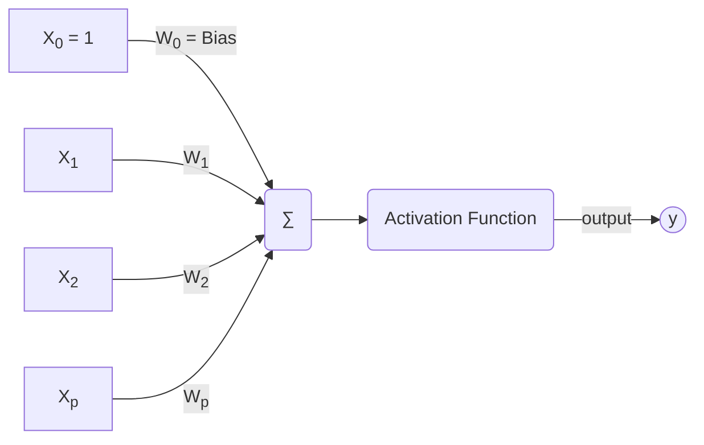

# Reti Neurali e Deep Learning - 9CFU

### Composizione esame
- Scritto
  - Domande aperte
  - domande su laboratorio in classe
  - Esercizi

## introduzione

Cosa sono le reti neurali?
Modelli computazionali che si ispirano al cervello umano per risolvere una serie di task
- Riconoscere digit all'interno  di un'immagine  
- Descrivere le immagini
- Memorizzare informazioni  per riuscire a ricostruire  immagini corrotte
- Scoprire regolarità all'interno di un dataset

Queste reti sono direttamente ispirate al comportamento del nostro cervello per risolvere determinati task, quindi le reti neurali prendono ispirazione dalla neuroscienze e dalla psicologia a al contempo viceversa infatti spesso le reti hanno potere esplicativo per capire come ragiona il nostro cervello per determinati task.

Sia all'interno del nostro cervello che nelle reti neurali l'elemento principale è il **Neurone**
Esso infatti è l'elemento base del nostro cervello e compie un'azione semplicissima:
Prendo l'informazione che mi arriva e se è maggiore di una certa soglia di attivazione la propago.

L'idea è che il singolo neurone è poco potente ma nel nostro cervello sono presenti circa 85 miliardi di neuroni uniti tra di loro da milioni di milioni sinapsi.

Nelle reti neurali abbiamo una struttura simile una serie di neuroni collegati tra loro da sinapsi artificiali simulate da pesi. Il **variare dei pesi** permette alla rete di apprendere. Infatti nelle reti neurali memoria e processamento si fondono.
 
I neuroni lavorano in parallelo. 

Il modello proposto da McCulloch–Pitts del 1943 è semplice



Abbiamo una serie di input $X_1 ... X_p$ associati a relativi pesi $W_1 ... W_p$ aggiunto a questo abbiamo un valore b detto **Bias** che ci permette di giocare con l'eccitabilità del neurone sostanzialmente quanto è più o meno sensibile a propagare il segnale. Per semplicità viene utilizzato come peso $W_0$ associato ad un input impostato sempre ad 1.  A questo punto l'input verso il neurone j viene così calcolato: 
$$J = \sum_{i=0}^{p} W_{ji} X_i $$

A questo punto l'input viene valutato dalla funzione i attivazione del neurone J per ottenere  l'output **y** ogni rete ha la sua struttura e la sua funzione di attivazione che la caratterizza rispetto alle altre.

## Percettrone
Il percepttrone è un modello di rete neurale artificiale, introdotto nel 1958 dallo psicologo statunitense Frank Rosenblatt. Il percettrone è un tipo di classificatore binario.

Questa architettura è molto semplice, è caratterizzata da in singolo livello di neuroni che ricevono $p$ input $X_1 ... X_p$. 

### Problema linearmente separabile
Questa architettura si puo applicare su problemi **linearmente separabili**, geometricamente, questa condizione descrive la situazione in cui esiste un iperpiano in grado di separare, nello spazio vettoriale degli input, quelli che richiedono un output positivo da quelli che richiedono un output negativo. Se il problema non è linearmente seprabile questo modello non converge e fallisce.

Per semplificare lo studio prendiamo in analisi un architettura composta da un singolo neurone e il bias viene inglobato nel vettore pesi W come $W_0$ associato all'input $X_0 = 1$.

La funzione di attivazione è molto semplice:
- Se la sommatoria del prodotto scalare del vettore di input X per quella dei relativi pesi W $\sum_{i=0}^{p} W_{ji} X_i > 0$ allora il neurone restituisce 1
- Altrimenti -1 quindi caso di $\sum_{i=0}^{p} W_{ji} X_i \leq 0$

Problemi semplici da modellare con questa configuarazione sono ad esempio il problema dell'OR oppure quello dell'AND. La rete per poter apprendere la configurazione di pesi corretta esegue il seguente pseudo codice:
```vbnet
n=0;
  Inizializza w casualmente; #Il vettore pesi inzialmente ha pesi casuali
  While(Abbiamo esempi del trainig set classificati male)
    Seleziono un esempio classificato male(x(n), d(n)) #x(n) è il nostro input mentre d(n) è il desiderato
    if(d(n)==1), W[n+1] = W(n) + ηx(n); #Se volevo ottenre 1 e ricevo -1 allora aggiungo al vettore pesi n+1 l'input classficato male moltiplicato per il learning rate
    if(d(n)==-1), W[n+1] = W(n) - ηx(n); #Se volevo ottenre -1 e ricevo 1 allora tolgo al vettore pesi n+1 l'input classficato male moltiplicato per il learning rate
    n=n+1;
  End While
```


Sappiamo che se il problema è linermente separabile grazie al **teorema di convergenza**

### Teorema di Convergenza
Questo teorema utilizza la rappresentazione geometrica deil vettore pesi e del vettore stimoli (input) geometricamente il prodotto tra due vettori in questo caso abbiamo  **w(n)** cioè w all'iterazione n e **x(n)** è uguale a $w(n) x(n) = ||w|| ||x|| cos(\theta)$ questo prodotto sarà: 
- maggiore di 0 se: l'angolo $-90 < \theta < 90$
- uguale a 0 se: l'angolo $\theta = 90$ oppure $\theta = 270$
- minore di 0 se: $90 < \theta < -90$
Geometricamente la soluzione proposta da un vettore pesi w è detto **Decision Boundary** cioè la retta perpendicolare al vettore dei psi che divide le due soluzioni. Tutti gli elementi alla destra del decision boundary hanno prodotto maggiore di 0 quindi il percettrone restituirà come output 1 mentre quelli sulla sinistra avranno prodotto minore o uguale a 0 e quindi il percettrone restituisce -1.

Ogni volta che applico l'algoritmo di apprendimento è come se cambiassi l'inclinazione del decision boundary.

Per dimostrare che i passaggi il teorema di convergenza dobbiamo capire che se il problema è linearmente separabile ad un certo punti troveremo un decision boundary che soddisfa in toto il nostro problema. Quindi dobbiamo dimostrare che i passaggi sono finiti.

Partiamo da qualche assunzione:
- il vettore pesi w viene inizializzato a 0
- il learning rate è posto a 1
- dobbiamo trasformare il problema in un problema equivalente normalizzato, vogliamo quindi che gli output del percettrone siano sempre 1 quindi nel caso in cui vogliamo il valore negativo dobbiamo moltiplicare per -1 gli input e l'output:

AND
| input | output |    | input   | output |
|-------|--------|----|---------|--------|
| 1,1,1  |     1   | -> |    1,  1,  1  |    1   |
| 1,1,0 |   -1   | -> | -1,-1, 0 |    1   |
| 1,0,1 |   -1   | -> | -1, 0,-1 |    1   |
| 1,0,0 |   -1   | -> |  -1, 0, 0 |    1   |

Questa trasformazione comporta che non abbiamo piu due possibilità in caso di mal classificazione, infatti l'unica opzione che abbiamo è che noi volessimo 1 come output e il vettore pesi proposto restituisca -1, quindi l'algoritmo di apprendimento è come se fosse semplificato. Questo ci permette di identificare il vettore pesi w(k+1) come la somma di tutti gli stimoli sbagliati da 1 a k quindi: $$w(k+1) = x(1) + ... + x(k)$$
Questo perchè w all'inizio è posto a 0

A questo punto vogliamo studiare come varia la norma al quadrato del vettore pesi ad ogni modifica, quindi ad ogni iterazione k. Il teorema di convergenza stabilisce 2 limiti:
1. Limite Inferiore: la norama del vettore peso al quadrato all'iteazione k+1 sarà sempre mggiore uguale di $k^2$ qualcosa, quindi crescerà almeno tanto velocemente quanto $k^2$. $$||w(k+1)||^2 \geq \frac{k^2 \alpha^2}{||w*||^2}$$ 
2. Limite Superiore:  la norama del vettore peso al quadrato all'iteazione k+1 deve essere minore uguale di k qualcos'altro. $$||w(k+1)||^2 \leq k \beta$$

Per rispettare entrambe i limiti sappiamo che c'è un momento in cui questi due limiti vengono invalidati. infatti $k^2$ cresce piu velocemente di k quindi avremo un momento in cui k deve smettere di crescere altrimenti i limiti vengono violati. Questo vuole dire che k crescerà in modo finito e terminerà prima che k contraddica uno dei due lower boud.

## ADALINE
Adaptive Linear Neuron comunemente conosciuta come Adaline è anch’essa un'architettura a singolo livello come il percettrone nasce nel 1960 dal professore Bernard Widrow e il dottorando Ted Hoff all’università di Stanford.

La rete ADALINE (Adaptive Linear Neuron) è una rete neurale feedforward a uno strato che utilizza il Delta Rule per l'apprendimento supervisionato. È composta da uno strato di input, uno strato di uscita e uno strato di pesi. L'obiettivo della rete ADALINE è quello di imparare una funzione di mappatura tra gli input e gli output attraverso l'apprendimento supervisionato, cioè utilizzando un set di esempi di input e output noti.

Si basa sempre sul neurone di McCulloch–Pitts.

Addotta come algoritmo di apprendimento una semplificazione dell'algoritmo di back propagation chiamato delta rule

### Delta Rule 
Il Delta Rule è un algoritmo di apprendimento per reti neurali artificiali. Si tratta di un metodo di ottimizzazione utilizzato per la formazione di reti neurali feedforward, in particolare per la formazione di reti neurali adaline.

Il Delta Rule utilizza un approccio di gradient descent per l'ottimizzazione dei pesi della rete ADALINE. In pratica, il Delta Rule calcola l'errore $E^{(k)}$ tra l'output desiderato identificato con $d^{(k)}$ e l'output ottenuto dalla rete identificato con $y^{(k)}$, e utilizza questo errore per aggiornare i pesi della rete in modo da minimizzare l'errore. 
La formula di calcolo delle errore per il delta rule sul kappesimo esempio è la seguente:
$$ E^{(k)}(w)=\frac{1}{2}(d^{(k)} - y^{(k)})^2 = \frac{1}{2}(d^{(k)}\sum_{j=0}^m X^{(k)}_j w_j)^2 $$
L'errore totale che è la somma dei quadrati degli errori per tutti gli esempi è calcolato come:
$$E_{tot}=\sum_{k=1}^N E^{(k)}$$
Questo processo viene ripetuto finché l'errore non raggiunge un livello accettabile o finché non si raggiunge un numero massimo di iterazioni.

In sintesi, il Delta Rule è un algoritmo di apprendimento utilizzato per la formazione di reti neurali adaline, che permette alla rete di imparare una funzione di mappatura tra gli input e gli output attraverso l'apprendimento supervisionato utilizzando un approccio di gradient descent per l'ottimizzazione dei pesi.

## Multi layer Perceptron
Il MLP è stato sviluppato a metà degli anni '60 da Bernard Widrow e Marcian Hoff, che cercavano un modo per utilizzare le reti neurali per il riconoscimento delle parole. Il loro obiettivo era quello di sviluppare una rete neurale in grado di riconoscere le parole dall'audio, utilizzando una serie di microfoni distribuiti su una superficie per raccogliere i segnali audio.

Il MLP è stato anche uno dei primi esempi di rete neurale a più strati, e ha stabilito le basi per lo sviluppo di altri tipi di reti neurali a più strati, come le reti convolutional neural networks (CNN) e le reti recurrenti (RNN).

### Architettura
Il Multi Layer Perceptron (MLP) è una rete neurale feedforward a più strati che utilizza l'apprendimento supervisionato per imparare una funzione di mappatura tra gli input e gli output. È composta da uno o più strati di neuroni artificiali, ciascuno dei quali è formato da un insieme di pesi e bias che vengono aggiornati durante il processo di apprendimento.


Il MLP è stato successivamente utilizzato in diversi campi, come il riconoscimento delle parole, il riconoscimento dei pattern, il processamento del linguaggio naturale e il machine learning in generale. In pratica tutti i problemi che **non sono linearmente separabili** dove il perceptron falliva.
È ancora ampiamente utilizzato oggi per risolvere molti problemi di machine learning, in particolare nei casi in cui è necessario modellare relazioni non lineari tra gli input e gli output.

A differenza di Adeline i neuroni all'Interno di MLP hanno una cosiddetta funzione di attivazione o trasferimento $\varphi$ detta **sigmoide** definita come:
$$\varphi(V_j)=\frac{1}{1+e^{-av_j}}$$ con a > 0 
Questa funzione è molto importante perché è continua e derivabile e dato che l algoritmo di apprendimento back propagation si basa proprio sulle derivate 

### Back Propagrtion 
La back propagation differenzia due tipi di correzioni diversi a seconda di dove si trovi il peso che stiamo cercando di correggere. Abbiamo due casi:
1. Il peso che vogliamo correggere collega il livello hidden e il livello visible 
2. Il peso che vogliamo correggere connette l'input al livello hidden o livelli hidden interni alla rete 
Lo scopo finale a prescindere rimane quello di aggiornare il peso della sinapsi al fine di minimizzare l'errore commesso su ogni esempio del Training set.

L'algoritmo si basa sul ripetere più volte i 2 seguenti step:
1. **Forward pass** consiste nel posizionare sul livello di ingresso i valori che rappresentano ogni esempio del nostro training set e sulla base di quello propagheremo in avanti fino a trovare un valore di uscita, inizialmente questo processo verrà fatto con pesi **casuali**
2. **backward pass** consiste nel correggere ogni peso in base all output della rete questo avviene calcolando il gradiente locale
3.  


La funzione di errore che prendiamo in considerazione è **Total Mean Squared Error**, questa può variare in base al problema è all'architettura. Gli step per calcolare l'errore totale sono i seguenti:
- Ottenere l'errore sul neurone j come $e_j(n) = d _j(n) - y_j(n)$
- Ottenere l'errore cumulativo come $E(n) = \frac{1}{2} \sum_j e_j^2(n)$
- Prendere la media delle errore come $E_{AV} = \frac{1}{N} \sum_{n=1}^N$
A questo punto il nostro obiettivo è trovare un minimo nella funzione di errore che è in funzione dei pesi della rete. 
Ad ogni passaggio modifichiamo ogni peso con la formula che segue:
$$W_{ji} = W_{ji} + \Delta W_{ji}$$ 
Dove $W_{ji}$ indica il peso tra il neurone i e il neurone j. 
Per ottenere il Delta da sommare al peso invece abbiamo:
$$\Delta W_{ji} = -\eta \frac{\partial E}{\partial W_{ji}}$$
La correzione dei pesi non è perfetta questo perché ogni esempio ha esigenze diverse e quello che facciamo è fare una sorta di *media* tra le esigenze. Questo si riscontra dal fatto che le condizioni di terminazione di back propagation non è l'errore nulla ma l'ottenimento di un errore accettabile. 

Per riuscire ad arrivare ad una situazione stabile se abbiamo m esempi nel nostro training set dovremo farli vedere alla rete più volte tutti, ogni volta che li lastriamo tutti passi a **un'epoca**

 Prendendo in considerazione un neurone j che ha come ingresso l'uscita y di m neuroni pesata sul relativo peso w otteniamo quindi che il suo input sarà:
 $$V_j = \sum_{i=0,…,m}w_{ji}y_i$$
 Quello che vogliamo valutare è il cambiamento dell Errore al variare di un singolo cambiamento di pesi $w_{ji}$ per fare questo spezzo le due derivate per calcolare l'errore E sulla base dell'input $V_j$ che riceve il mio neurone j e come cambia proprio $V_j$ sulla base del cambiamento del peso $w_{ji}$ passando così a:
 
 $$\frac{\partial E}{\partial W_{ji}} = \frac{\partial E}{\partial v_j}\frac{\partial v_j}{\partial W_{ji}}$$
La prima derivata viene definita **segnale di errore** ottenendo:
$$\delta_j = -\frac{\partial E}{\partial v_j}$$
La seconda derivata invece posso trattarla come $y_i$ quindi l'uscita del neurone i-esimo:
$$\frac{\partial V_j}{\partial W_{ji}} = y_i$$
Arrivando quindi a generalizzare la modifica di un peso $w_{ji}$ è:
$$\Delta W_{ji} = \eta \delta_j y_i$$
Quindi abbiamo la moltiplicazione tra il **segnale di errore** e **l'input che mi arriva dal livello precedente**

A questo punto come anticipato succedono due cose differenti in base a dove si trova il neurone j che stiamo considerando é:
- Un neurone a livello di uscita sarà più semplice perché "vede" l'output e lo può confrontare con il t desiderato. Per come abbiamo definito l'errore $e_j$ possiamo riscrivere la formula come segue:
 $$-\frac{\partial E}{\partial v_{j}} =-\frac{\partial E}{\partial e_j} \frac{\partial e_j}{\partial y_j}\frac{\partial y_j}{\partial v_{j}}$$
Questo perché l'errore totale dipende a catena da $e_j$ che dipende a sua volta da $y_j$ che dipende da $v_j$ riscrivere in questo il segnale di errore ci aiuta perché facendo i calcoli abbiamo che:
$$-\frac{\partial E}{\partial v_{j}} =-\frac{\partial E}{\partial e_j} \frac{\partial e_j}{\partial y_j}\frac{\partial y_j}{\partial v_{j}} = -e_j (-1) \varphi^{'}(v_j)$$
Quindi In definita il nostro $\Delta W_{ji}$ per un neurone a livello di uscita sarà:
$$\Delta W_{ji} = \eta (d_j - y_j) \varphi^{'}(v_j) y_i$$
Dove $\varphi^{'}$ indica la derivata prima della funzione di attivazione del neurone

- Un neurone hidden il calcolo è più complesso questo perché non affacciandosi all'uscita non può vedere il target 


Quindi scorporiamo sempre il nostro segnale di errore come 
$$\delta_j = -\frac{\partial E}{\partial y_j}\frac{\partial y_j}{\partial v_{j}}$$
Come prima sappiamo calcolare $\frac{\partial y_j}{\partial v_{j}}$ che è:
$$\frac{\partial y_j}{\partial v_{j}} = \varphi^{'}(v_j)$$
Mentre il primo termine non è più uguale perché deve tenere conto di tutti i $v_k$ su cui agisce l'output $y_j$ quindi avremo che:
$$\frac{\partial E}{\partial y_j} = \sum_{k} \frac{\partial E}{\partial v_k} \frac{\partial v_k}{\partial u_{j}}$$
Ma noi qui sappiamo che il termine $\frac{\partial E}{\partial v_k}$ lo abbiamo calcolato precedentemente come $\delta_k$, quindi il segnale di errore $\delta_j$ sarà:
$$\delta_j =\sum_{k} \delta_k * W_{kj} * \varphi^{'}(v_j)$$

La correzione per il peso $\Delta W_{ji}$ in definitiva è:
$$\Delta W_{ji} = \eta \text{ }y_i \sum_{k} \delta_k * W_{kj} * \varphi^{'}(v_j)$$

### Generalized delta rule
Rispetto a quanto visto con l'algoritmo di back propagation aggiungiamo un pezzo nello specifico sommiamo oltre alla correzione attuale la correzione fatta al passo precedete modulata da un certo coefficiente di proporzionalità $\alpha$.
Questo lo facciamo per stabilizzare la decrescita dell'errore questo perché se stiamo scendendo decisi verso il minimo dell'errore l'interazione precedentemente avrà lo stesso segno di quella attuale e quindi permette di svendere più veloce mente verso il minimo. 
Al contrario se siamo molto vicini al minimo può essere che il passo precedente avesse segno discorde e quindi permette di "rallentare" la discesa.
$$\Delta W_{ji}(n) =\alpha \Delta W_{ji}(n-1) +\eta \text{ } \delta_j(n)\text{ }y_i(n) $$
Il parametro introdotto $\alpha$ è un altro iper paramento simile a learning rate $\eta$

### Algoritmo di apprendimento 
- Per pattern 
- Per epoche 
 
Non esistendo un teorema di convergenza come il percettrone dobbiamo definire dei criteri di stop per fermare l'algoritmo:
- fermare quando l'errore raggiunge un livello abbastanza basso. Il problema qui è che sto valutando l'errore sul training set ma in realtà quello che poi vado a fare è usare la rete con esempi mai visti quindi l'errore calcolato precedentemente non mi dice nulla 
- Fermare l'algoritmo quando la rete neurale generalizza a sufficienza, per fare questo non posso usare il training set per i motivi appena visti, quindi all'inizio mi calcolo un validation set e ogni tot calcolo l'errore su quello che è esplicativo.

### NN design
- Data representation: la modalità più classica è che una rete può prendere in input valori reali continui l'idea è quella di normalizzare l'input perché le varie features hanno scale differenti 
- network topology: si parte da una rete grossa e successivamente si fa pruning oppure l'esatto opposto pochi neuroni e poi aumento via via
- network parameters: tanto più una rete è grossa tanto più esempi devo far vedere alla rete 

## Radial Basis Function 
Queste reti neurali sono caratterizzate dalle funzioni radiale, essa è una funzione la cui uscita dipende dalla distanza tra l'input (argomento della funzione) e un determinato vettore. Il modello più diffuso è la Gaussiana, essa è simmetrica sul punto di centro.

All'interno della rete neurale queste funzioni vanno a sostituire le funzioni di trasferimento sigmoidali.
Questo permette di valutare la vicinanza tra il punto p e il centro.


### Architettura 
Solitamente queste reti neurali contengono 1 solo livello nascosto e all'interno del livello nascosto inserire queste funzioni all'interno dei neuroni a livello hidden.
I neuroni di uscita invece hanno uscita lineare per fare questa fa una somma pesata del livello nascosto, i pesi con cui viene effettuata questa operazione sono i pesi W. 

Quindi a differenza del multi layer perceptron in apparenza abbiamo solo un livello di pesi quelli tra il livello hidden e il livello di uscita.


L'output per il neurone y viene valutato come somma pesata della funzione $\phi$ che ha come argomento la norma della distanza tra il nostro esempio x e il **centro della funzione** chiamato $t_i$.

$$y=w_1\varphi_1(||x-t_1||)+...+w_{m1}\varphi_m(||x-t_m||)$$

Anche i centri sono parametri che la rete deve imparare ma differiscono dai pesi perché non sempre sono oggetto di addestramento ma possono essere iper parametri.

Oltre al centro la funzione $\varphi$ ha un altro parametro importante che è lo **spread** $\sigma$ che indica la larghezza della campana di gauss anche questo come il centro è un parametro che può essere imparato dalla rete oppure passato in input come iper parametro.

### Interpolazione
L'interpolazione è una tecnica matematica che consiste nel trovare una funzione che passa attraverso un certo numero di punti noti. In altre parole, l'interpolazione consiste nel trovare una curva che sia il più possibile simile a un insieme di punti dati.

Ad esempio, supponiamo di avere un insieme di punti (x, y) noti, dove x rappresenta la variabile indipendente e y rappresenta la variabile dipendente. Se vogliamo trovare una funzione che rappresenti questi punti, possiamo utilizzare l'interpolazione per trovare una curva che passi attraverso tutti i punti.

Esistono diversi tipi di interpolazione, come l'interpolazione lineare, l'interpolazione polinomiale e l'interpolazione spline. Ognuno di questi metodi utilizza un approccio leggermente diverso per trovare la curva che meglio si adatta ai punti dati.

### learning Algorithm 1
Si focalizza su insegnare alla rete come individuare:
- Centri t, vengono selezionati a caso
- Le larghezze $\sigma$ calcolata come segue: $$\sigma=\frac{dMax}{\sqrt{dN}}$$
Dove dMax indica la distanza massima tra due centri definiti in precedenza e dN è il numero dei centri. La funzione di attivazione generica diventa $$\varphi(||x-t_i||^2)=exp(-\frac{m_i}{d_{max}^2}||x-t_i||^2)$$

Quello che chiedo per cercare i pesi w non è trovare l'uguaglianza con il desiderato, ma trovare qualcosa di simile al mio d questo mi permette di ridurre anche il numero delle colonne quindi non avere una matrice quadrata N x N ma N x m-1 così da non avere un neurone per ogni esempio ma solo m1 questo mi permette di ridurre la dimensione e soprattutto di non fare overfitting sul Training set.


Quello che capita a questo punto è che non posso più fare è calcolare l'inverso della mia matrice perché non è più una matrice quadrata quindi partendo da:
$$\Phi w = d$$
per trovare il vettore w non è più possibile fare 
$$w=\Phi^{-1}d$$

Dobbiamo quindi usare una matrice **pseudo inversa** per riuscire a trovare w. 
Per fare questo moltiplico i membri per la matrice trasposta ottenendo:
$$\Phi^T\Phi w = \Phi^T d$$
Definiamo ora la pseudo inversa come:
$$\Phi^+ \equiv (\Phi^T\Phi)^{-1}\Phi^T$$
A questo moltiplichiamo entrambe i membri per $(\Phi^T\Phi)^{-1}$ ottenendo:
$$(\Phi^T\Phi)^{-1}\Phi^T\Phi w=(\Phi^T\Phi)^{-1}\Phi^Td$$
A questo punto la parte destra si semplifica e la sinistra se proprio la pseudo inversa definita precedentemente il risultato è:
$$w = \Phi^+d$$

Tutto questo è valido per una matrice non singolare.
Una matrice è detta singolare se il suo determinante è uguale a zero. Una matrice singolare non ha un inverso, il che significa che non è possibile utilizzarla per risolvere sistemi di equazioni lineari o per calcolare il gradiente di una funzione in un punto specifico.

Una matrice può essere singolare se ha una riga o una colonna di elementi tutti uguali a zero, o se ha due righe o due colonne linearmente dipendenti. Ad esempio, la matrice seguente è singolare perché ha una riga di elementi tutti uguali a zero:

[0 0 0]

Un'altra matrice singolare è la seguente:

[1 2 3]
[4 5 6]
[7 8 9]

In questo caso, la terza riga è una combinazione lineare della prima e della seconda riga, quindi la matrice è singolare.

Una matrice singolare può essere problematica in alcuni casi, ad esempio quando si utilizza un algoritmo di regressione che assume che la matrice di design sia invertibile. In questi casi, può essere necessario eliminare alcune variabili dal modello o trasformare i dati in modo da evitare matrici singolari.

Caso peggiore è quando abbiamo una matrice quasi singolare, che qui di matematicamente è possibile invertire ma provoca risultati inattesi. Quindi di ottenere target molto diversi da quelli che volevo ottenere.

Una matrice quasi singolare è una matrice il cui determinante è molto piccolo, ma non esattamente zero. Una matrice quasi singolare può essere utilizzata per risolvere sistemi di equazioni lineari, ma può causare problemi di precisione a causa della sua piccola scala.

### Learning  Algorithm 2: Centers
Questo algoritmo gestisce la creazione per i centri delle funzioni radiali non inizializzandole a caso ma utilizzando un approccio stile SOM. In cui i centri vengono attirati dagli input fino a raggiungere una stabilità.

## Extreame Learning Machine
L'Extreme Learning Machine (ELM) è una tecnica di apprendimento automatico che mira a costruire un modello di classificazione o regressione con alta accuratezza e velocità di esecuzione. Si basa sull'ipotesi che un modello con un numero sufficientemente grande di neuroni nascosti può approssimare qualsiasi funzione con precisione sufficiente.

In pratica, l'ELM utilizza una rete neurale feedforward con un numero elevato di neuroni nascosti e una funzione di attivazione non lineare. I pesi dei neuroni nascosti vengono inizializzati in modo casuale e vengono quindi ottimizzati utilizzando un algoritmo di risoluzione di equazioni lineari. In questo modo, l'ELM può addestrare un modello di alta accuratezza in tempi di esecuzione relativamente brevi, senza richiedere il processo di backpropagation utilizzato nella maggior parte delle reti neurali standard.

Infatti passando da avere 2 pesi da "trovare", quelli che connettono l'input al layer hidden e quelli che connettono il layer hidden al visible passiamo a solo 1 vettore W da trovare dimezzando di fatto la complessità. Inoltre sfruttando l'intuizione visto precedentemente possiamo apprendere il vettore W one shot andando a sfruttare la matrice pseudo inversa.

Uno dei principali vantaggi dell'ELM è la sua semplicità. Non è necessario utilizzare algoritmi di ottimizzazione complessi come il gradiente discendente per addestrare il modello, rendendolo ideale per situazioni in cui è necessario addestrare un modello rapidamente. Inoltre, l'ELM è meno sensibile alle variazioni nei dati di input rispetto ad altri algoritmi di apprendimento automatico, il che lo rende particolarmente adatto per il trattamento di dati altamente variabili.

### Algoritmo di apprendimento
Come inizializzazione dobbiamo prendere un insieme di N punti intesi come coppie input, etichetta desiderata $(x_i, t_i)$ rispettivamente N ed M dimensionali, funzione di attivazione G e un insieme di Neuroni hidden.
1. Calcolare in modo random i pesi associati al l'input w e al bias b
2. Calcolare la matrice in output del hidden layer
3. Calcolare con la pseudo inversa i pesi tra livello hidden e visibile $\beta$
$$\beta =(H^TH)^{-1}H^T T$$

Questi passi vengono ripetuti più volte cambiando i parametri in input 

Similmente a quanto visto per RBF anche in questo caso non possiamo eseguire l algoritmo con matrici singolari o quasi singolari.

### Regolarizzazione
Il processo di regolarizzazione permette di allontanare una matrice dalla situazione di quasi singolarità. Questo grazie ad un parametro $\lambda$ scelto che va a sommarsi alla matrice trasporta moltiplicata per la matrice prima dell'inversione rendendo di fatto la formula:
$$\beta =(H^TH+\lambda I)^{-1}H^T T$$

Questo $\lambda$ diventa a tutti gli effetti un iper parametro della rete.

Tuttavia, l'ELM ha anche alcuni svantaggi. In particolare, poiché i pesi dei neuroni nascosti vengono inizializzati in modo casuale, il modello ELM può essere soggetto a un elevato scostamento nella sua accuratezza. Inoltre, poiché l'ELM non utilizza il processo di backpropagation, non è possibile utilizzare tecniche come il dropout per prevenire il sovraadattamento. Ciò significa che l'ELM potrebbe essere meno adatto per i dati con una grande quantità di rumore o per i dati con un numero limitato di esempi di training.


## Deep Neural Network
Abbiamo un'organizzazione a livello gerarchico in cui abbiamo n livelli nascosti che possono essere molti anche 100 e il numero di neuroni presenti in ogni livello hidden. Naturalmente più neuroni abbiamo a livello hidden più pesi abbiamo da trovare quindi è più difficoltoso la fase di addestramento. Non sempre dimensioni e accuratezza vanno di pari passo.

Abbiamo tre grandi famiglie di DNN:
- reti Supervisionate feed forward utilizzate per regressione e classificazione 
    - CNN
    - FC DNN
    - HTM
- reti non supervisionate, modelli generativi 
    - Auto encoders
    - RBM
    - DBN
- Recurrent neural network
    - RNN
    - LSTM
    - TRANSFORMER

Le ragioni del successo dei modelli profondi sono state l'avvento delle GPU per processare il training e l'avvento dei big data utili per addestrare la rete.

Un altra svolta è il passaggio dalla funzione di attivazione **sigmoide** alla **relu**. 
Questo perché nella back propagation utilizzando la derivata della funzione di attivazione con la sigmoide provocava un vanishing gradient perché per + e - infinito era piatta.
Con la relu risolviamo questo problema 


## Convolutional Neural Network
Le caratteristiche principali della CNN sono **local processing** ogni neurone non è più connesso a. Tutti gli altri a solo ad una parte, questo provoca una riduzione enorme delle connessioni necessarie e quindi delle operazioni da eseguire per addestrare la rete.


L'altra caratteristica è che le **connessioni sono condivise** 


Da questo viene definito il concetto di **Filtro** o kernel che è il ventaglio di pesi con i quali il neurone guarda ad una porzione in qualche modo definita del livello precedente 

Possiamo imparare allo stesso tempo diversi filtri convoluzionali allo stesso tempo

ogni livello processa l'input con pesi diversi dai layer prima usando sempre propensi uguali per lo stesso livello ma diverso dagli altri livelli questi livelli vengono detti **features map**

Una rete convoluzionale è pensata per il processing di immagini perché si presta molto bene al processing locale. Oltre a questa applicazione si possono usare per speech recognition.

### Architettura 
L'architettura di una CNN è composta da una serie di livelli in cui il primo livello è il nostro oggetto di studio, ad esempio un immagine, gli ultimi livelli sono completamente connessi e operano come un multilayer perceptron che classifica. I livelli in mezzo hanno connessioni locale e pesi condivisi che possiamo immagina re come il processing dell input per il nostro classificatore finale.

La grande rivoluzione è che il processing non è svolto da un umano ma dalla rete convoluzionale
Più sono vicino al l'input più le caratteristiche riconosciute sono elementari, più sono vicino al classificatore più cose complesse

### Convoluzione
Il livello convoluzione equivale ad applicare un filtro alla nostra immagine, il primo livello convoluzionale è composto da una serie di Neuroni che sono connessi parzialmente al nostro input. Tra i due livelli abbiamo una sorta di maschera che pesa la porzione di input che sta analizzando facendo il prodotto scalare tra input e maschera 


 
 Per i neuroni laterali quindi per evitare di uscire fuori si usa del padding di solito 0
 
### Pooling
Il livello di pooling si pone dopo il livello convolutional e aggrega l'informazione in due modi:
- **Max pooling** prendo il valore massimo tra quelli che sto osservando 
- **Average pooling** prendo la media dei valori che sto osservando 
Il livello di pooling non ha parametri da imparare 

Quindi sostanzialmente vado a ridurre la dimensione della rete  

### Funzione di attivazione
Come anticipato viene sostituita la sigmoide con la relu che è nulla per i valori negativi ed è la bisettrice del primo quadrante per valori positivi. 
Nel punto 0 la relu non è derivabile però viene gestita associandola ad una dei due insieme quindi il caso che vale 0 e quella che vale 1

### Funzione Soft-Max e Cross entropy
Il livello di uscito di una CNN nella sua applicazione più classica ovvero la classificazione è costituito da neuroni che hanno funzione di attivazione detta Soft Max definita come:
$$z_k = f(v_k)=\frac{e^{v_k}}{\sum_{c=1...s^{e^{v_c}}}}$$

La cross entropy invece permette di determinare quanto è buono il risultato q rispetto a quello che volevo ottenere p con la formula definita come segue:
$$H(p,q)=-\sum_v p(v) * log(q(v))$$

Quindi in conclusione le cose che ci servono impostare in una CNN sono i seguenti iperparamentri:
- numero dei filtri convoluzionali 
- Dimensione del kernel: è quanto è grossa la nostra matrice dei pesi quindi quanto è locale la nostra analisi sul input se k è troppo grande non va bene 
- Padding: per analizzare maggiormente le parti periferiche si aggiunge padding ai bordi
- Stride: quanto salta il kernel tra un passaggio e l'altro, se lo stride è della stessa dimensione di k ogni pixel viene analizzato una sola volta. Di solito si usa 1

### Transfer learning
Con site nell addestrare una rete CNN ad un task specifico e una volta addestrata separare la parte convolutional e usarla per altri task a quel punto devo solo ri allenare i livelli completamente connessi per il task specifico. 

## Self-Organizing Map
Le self-organizing map (**SOM**) sono un tipo di organizzazione di processi di informazione in rete analoghi alle reti neurali artificiali.

Le SOM sono addrestate usando l'apprendimento **non supervisionato** l'idea alla base è quella di dare in input alla rete un training set nel formato $x_1 ... x_n$ dove ogni $x$ è un vettore di pesi che rappresnta il singolo input. 

La rete dato un traning set modificherà il vettore pesi associato ad ogni neurone per fare in modo di riconoscere un determinato gruppo di input e mapparlo. Possiamo dire qundi che una SOM consente di produrre una rappresentazione dei campioni di training in uno spazio a bassa dimensione preservando le proprietà topologiche dello spazio degli ingressi.

La struttura delle SOM è differente dalle reti viste precedentemente. Non abbiamo piu il concetto di peso come sinapsi quindi collegamento tra neuroni qui abbiamo un'architettura piatta dove ogni neurone è collegato ad altri e questo collegaemnto indica semplicemente la vicinaza. Il vettore pesi è assocaito al neurone stesso e rappresenta quale input riconosce.

### Algoritmo di Apprendimento
L'obiettivo dell'apprendimento nelle self-organizing map è di specializzare parti differenti del reticolo SOM a rispondere similmente a particolari pattern d'ingresso. Questo è in parte motivato da come le informazioni sensoriali visive, uditive o di altro tipo sono gestite da parti separate della corteccia cerebrale nel cervello umano.

I pesi dei neuroni sono inizializzati a numeri casuali piccoli. 

L'addestramento utilizza l'apprendimento competitivo. Quando viene passato un campione di training in ingresso alla rete, viene calcolata la sua distanza euclidea da tutti i vettori dei pesi.  Quindi dato un input $x_i$ cerco qual è il neurone che lo "mappa" meglio. Il neurone col vettore dei pesi più simile all'ingresso è chiamato **Best Matching Unit** (BMU). 

I pesi del BMU e dei neuroni vicini a questo nel reticolo SOM vengono avvicinati al vettore d'ingresso, così facendo la BMU e i suoi vicini si *specializzano* nel riconoscere pattern simili a quello appena riconosciuto. L'intensità dell'avvicinamento decresce nel tempo e in funzione della distanza dei neuroni dal BMU. 

La formula utilizzata per l'aggiornamento dei pesi W di un neurone j è:$$w_j(n+1) = w_j(n)+ \eta(n) h_{j,i}(n)(x-w_j(n))$$

Abbiamo quindi il vettore pesi del neurone j per l'epoca n + 1 come la somma del suo vettore pesi attuale piu la differenza rispetto al suo vettore pesi attuale e l'input x ricevuto questo moltiplicato per due elemnti:
1. Il **Learning rate** $\eta$ decresce in modo monotono ad ogni nuova epoca per rendere meno impattante le modifiche sul peso dei neuroni.
2. la funzione $h_{j,i}$ detta **funzione di vicinato**, dipende dalla distanza nel reticolo fra il BMU (i) e il neurone j. Anch'essa decresce monotonicamente quindi con n vicina a 0 prenderemo molti neuroni vicini alla BMU piu si va avanti meno vicini subiranno l'aggioranamento. La BMU ha 1 come valore di $h_{j,i}$.

L'algoritmo di apprendimento ad ogni epoca quindi si compone di due macro fasi
1. La fase di **competizione** tra neuroni: calcolo la distanza euclidea per definire la BMU
2. La fase di **collaborazione**: Trovata la BMU aggiorno i pesi di essa e dei neuroni vicini nel reticolo 

### Passi dell'algoritmo
1. Assegna ai vettori dei pesi valori casuali
2. Prendi un vettore d'ingresso
3. Attraversa ogni nodo della mappa
    1. Usa la distanza euclidea per trovare somiglianze fra il vettore d'ingresso e il vettore dei pesi di ogni singolo nodo della mappa
    2. Individua il nodo a distanza minore (questo nodo verrà chiamato Best Matching Unit o BMU)
4. Aggiorna i nodi del vicinato di BMU "tirandoli" più vicino al vettore d'ingresso
$$w_j(n+1) = w_j(n)+ \eta(n) h_{j,i}(n)(x-w_j(n))$$

### Valutazione delle performance

## Reti di Hopfield
Queste reti appartengono al repertorio classico degli strumenti a disposizione di uno studioso di reti neurali. Nascono nel 1982 dal fisico Hopfiled.

Nascono con l'idea di svolgere un lavoro molto diverso da qualsiasi altra rete presente nella letteratura. Nascono per svolgere **Pattern Completion**, data un pezzo di informazione la rete riesce a ricavare l'informazione completa. La rete è composta da k memorie fondamentali cioè le cose che sa riconoscere. La memoria fondamentale viene utilizzata per recuperare la versione corretta di essa. Quindi in input riceviamo solo parte di una sua k memoria fondamentale e la rete in base a quello recupera l'informazione.

Queste reti sono ritenute molte importanti perché nelle neuroscience è studiato che la mente umana fa pattern completion spessissimo, quindi è una rete esplicativa da questo punto di vista. Questo è anche importante dal punto di vista dell'intelligenza perché mette assieme conoscenza e logica nel dedurre la conoscenza da un qualcosa a cui manca qualcosa.

### Architettura 
Le reti di Hopfiled sono composte da N neuroni connessi tra loro. Ogni neurone j è connesso con tutti gli altri neuroni presenti nella rete, tranne se stesso. Ogni neurone può assumere solamente 2 valori {1,-1}. Per calcolare l'attivazione di ogni sogno lo neurone j come la somma pesata degli output di tutti i neuroni connessi con j (quindi tutti gli altri tranne se stesso).


### Funzione di attivazione 
La funzione di attivazione è semplice: 
$$y_j (n) = \varphi(v_j(n)) $$
Dove 
$$v_j = \sum_{i=0}^{N} W_{ji} v_i$$

A questo punto abbiamo 3 opzioni al passo n per valutare $\varphi(v_j(n))$ il valore del neurone:
1. Se $v_j(n) > 0 \text{ allora } 1$ 
2. Se $v_j(n) < 0 \text{ allora } -1$ 
3. Se $v_j(n) = 0 \text{ allora } \varphi(v_j(n-1))$ quindi non modifico il peso 

### Retrieval Phase

Il funzionamento della rete si basa su questa logica di funzione di attivazione. Partendo da una configurazione della rete (input) di 1 e -1 si **sceglie un neurone a caso** e si calcola la sua attivazione. Questo per ogni neurone fino a quando la rete non raggiunge uno **stato stabile** cioè nessun neurone modifica più il suo peso questo significa che ha raggiunto probabilmente una sua memoria fondamentale k. Questa fase è detta **Fase di Recupero**
Tutto questo è garantito dal **teorema di convergenza**.

Ogni rete di Hopfiled possiede più stati stabili, sicuramente almeno 2 cioè lo stato stabile che chiamiamo s e lo stato stabile inverso $s^{-1}$. Ogni stato stabile funge da attrattore, cioè i neuroni tendono ad andare verso quel tipo di configurazione.

A partire da uno stato iniziale dato (input), in base alla scelta iniziale e le successive che facciamo, quindi quale neurone viene scelto durante il processo di aggiornamento ad ogni iterazione, può succedere di terminare in stati stabili differenti. Questo perché al variare della scelta del neurone al passo n possono variare gli input per i passi successivi. 

Nelle reti di Hopfiled si prende per buono lo stato stabile che restituisce, on top esiste una nozione di **energia** associata ad ogni stato. La misura di energia può essere diversa per stati stabili differenti, essa quindi potrebbe essere usata per scegliere lo stato stabile migliore. Naturalmente in caso di pattern completion di immagini ad esempio noi umani possiamo valutare visivamente la bontà dello stato stabile. Dato che ogni stato stabile è un insieme di 1 e -1 come abbiamo detto anche l'inverso di uno stato stabile è stabile.

Fino ad adesso abbiamo parlato di come una rete evolve da uno stato in input all'output per raggiungere uno stato stabile cioè una memoria fondamentale. Esiste però anche un'altra fase: come vengono cablate le memorie fondamentali all'interno della rete chiamata **Fase di Storage**

### Storage Phase
La fase di storage temporalmente avviene prima della fase di recupero di cui abbiamo appena parlato e punta a memorizzare n memorie fondamentali nella rete si compone di una esecuzione one shot.

Quindi a questo punto la domanda che dobbiamo porci è: come trovo dei pesi per le sinapsi dei miei neuroni che mi permettono di cablare la rete in modo tale da riconoscere una memoria fondamentale? 

L'idea per cablare una rete dato un input è di connettere neuroni che hanno lo stessa attivazione con pesi positivi mentre con pesi negativi quelli che hanno attivazioni opposte.

Per fare in modo quindi che ad esempio la configurazione [1,1] per due neuroni sia uno stato stabile è opportuno cablare i due collegamenti con pesi positivi perché come detto hanno attivazioni uguali. È importate mettere peso un peso maggiore di 0 e non 0 perché altrimenti la rete è si stabile, ma non attrae a se versioni corrotte della nostra memoria fondamentale quindi svolge a metà il compito della rete.

Questa intuizione usata si basa su un principio fondamentale delle neuroscience detto principio di **Hebb**: neuroni attivi contemporaneamente devono fortificare le sinapsi tra loro.

La regola quindi per cablare una rete di Hopfiled data una singola memoria fondamentale è: $w_{i,j} = f_1(i)*f_1(j)$ quindi il peso che connette il neurone i e il neurone j è dato dalla moltiplicazione tra il valore della memoria fondamentale 1 di i con il valore della memoria fondamentale di j. Quindi elementi concordi avranno valore positivo elementi discordi valore negativo.

La regola generale invece dove abbiamo K memorie fondamentali che vogliamo siano tutte memorie fondamentali è la seguente:
$$w_{i,j}=\frac{1}{K} \sum_{k=1}^{K} f_k(i) * f_k(j) \quad \forall i \neq j$$

Quindi noi vogliamo cablare contemporaneamente le K memorie fondamentali all'interno della nostra rete. Importante ricordare che ogni memoria fondamentale è un vettore di N etichette che assumono valore di {1,-1} e che N è anche il numero di neuroni nella nostra rete.

### Teorema di Convergenza
Questo teorema è fondamentale per le reti di Hopfiled, infatti garantisce che data una configurazione iniziale alla rete essa in un numero limitato di passi converge verso uno stato stabile che equivale ad una e memoria fondamentale k precedentemente memorizzata.

Questo teorema si basa sul concetto di **energia**, essa misura la propensione della rete a cambiare stato, quindi per il nostro obiettivo *'energy is bad'*. Uno stato con alta energia equivale ad una rete molto instabile.

Il teorema di convergenza si basa su una serie di intuizioni:
- Nella nostra rete abbiamo N neuroni nella nostra rete e ogni n può assumere valori 1 o -1 abbiamo $2^n$ possibili configurazioni di 1 e -1 per la nostra rete. Quindi abbiamo un numero **finito** di stati.
- Ad ogni stato è associato un livello di energia.

A questo punto l'idea è quella di dimostrare che ad ogni passaggio di stato della rete il livello di energia si abbassa, quindi essendo l'energia mappata 1 a 1 con gli stati anch'essa è un insieme finito. Quindi si arriva ad un punto in cui non esiste un livello con energia più bassa di quello in cui già mi trovo e quello è proprio lo stato stabile.

L'energia E è così definita: $E =-\frac{1}{2}\sum_i \sum_j w_{ij} v_i v_j$
Quindi ogni prodotto partecipa in modo specifico al fatto che l'energia generale aumenti o diminuisca. 

L'energia si abbassa se siamo nei casi:
- $y_i = 1, y_j =1, w_{ij} > 0$
- $y_i = -1, y_j = -1, w_{ij} < 0$

L'energia invece aumenta per configurazioni del tipo:
- $y_i = 1, y_j =1, w_{ij} < 0$
- $y_i = -1, y_j = -1, w_{ij} > 0$

A questo punto per dimostrate che la rete converge verso uno stato stabile è necessario andare a valutare l'energia della rate prima di modificare un certo neurone che chiamiamo k e dopo che lo abbiamo modificato. Intuitivamente dato che ad ogni passo ci avviciniamo allo stato stabile l'energia complessiva della rete diminuisce. 

### Pro contro delle Reti di Hopfiled 
1. La rete fa pattern completion 
2. Riesce a generalizzare un input, dati input simili riesce a generalizzare 
3. È robusta purché se vi sono delle sinapsi corrotte comunque riesce a funzionare in modo ragionevole 
4. Permette di estrarre prototipi, cioè se vengono proposti come memorie fondamentali  concetto molto simili la rete impara rappresentazioni simili tra le due 
5. Cattura nel principio di apprendimento il principio di Hebb che è universalmente accettato nelle neuroscience
6. Andando a memorizzare molte meteorite fondamentali all'interno della rete è possibile che si creino stati **stabili spuri** che non sono memorie fondamentali ma che nascono dall' interferenza tra esse
7. È possibile che una memoria fondamentale sia così minoritaria che non diventa stato stabile 
8. Si possono memorizzare 0.14 * N memorie fondamentali 

## Restricted Boltzmann Machine 
Questa nuova architettura nasce dal problema principale della rete di Hopfiled, cioè gli Stati stabili spuri quindi quelli che non coincidono direttamente con una delle memorie fondamentali apprese durante lo storing phase. 
Un workaround visto nelle reti Hopfiled per questo problema è limitare di molto le memorie fondamentali in base a quanti neuri ho. Questo naturalmente non è ottimale.

Il nostro obiettivo quindi è quello di eliminare gli stati spuri dalla rete di Hopfiled.

La prima idea era quella di cercare di introdurre una forma di unlearning quindi smemorizzando gli stati spuri quindi rimuovendo le informazioni inutili apprese.

La seconda idea è quella di cambiare l'architettura andando a spostare i neuroni su 2 livelli
1. Il primo livello si comporta come una rete di Hopfiled standard ed ed **visible**
2. il secondo livello invece è detto **hidden** ed é specializzato a riconoscere alcuni pezzi specifici della nostra memoria fondamentale, così da cercare di evitare di in stati stabili che non sono riconducibili a nessuna memoria fondamentale.

Le unità hidden quindi tendono a catturare le informazioni che caratterizzano una memoria fondamentale essendo in grado di fare ciò riescono anche a ricostruire versioni corrotte di esse.

La terza e ultima idea è la gestione **dell'energia**. Nelle reti di Hopfield l'energia era l'indicatore della propensione della rete a cambiare stato. Abbiamo visto che il cambio stato provoca una diminuzione dell'energia e mai un aumento, questo fenomeno però rende possibile per la rete rimanere "incastrata" in un minimo locale, nella macchina di Boltzmann invece l'energia viene valutata in modo **stocastico** quindi potenzialmente è possibile uscire da un minimo locale per trovarne uno migliore. Andando quindi a risolvere uno dei problemi più grandi delle reti di Hopfiled.

### Architettura
L'architetta si può riassumere quindi come la separazione in due livelli della nostra rete
1. Neuroni visible che si comportano come una rete di Hopfield classica
2. Neuroni hidden 


Nella versione restricted delle BM Ogni neurone hidden è connesso con ogni neurone visibile. La particolarità è che non vi sono connessioni tra neuroni hidden e nemmeno tra neuroni visibile. Sostanzialmente abbiamo connessioni dirette tra neuroni di livelli diversi.
Ogni neurone può assumere 2 stati possibili che chiamiamo $s_i$, lo stato è compreso nell'insieme {0,1}.

### Funzione di Attivazione 
Come detto la funzione di attivazione è stocastica 
$$p(s_i=1)=\frac{1}{1+e^{\frac{-\Delta E_i}{T}}}$$

Dove $\Delta E_i$ è **l'energy gap** quindi come cambia l'energia dell rete in base alla attivazione del neurone quindi abbiamo che:

$$\Delta E_i = E(s_i=0) - E(s_i=1)$$

Generalizzando la formula otteniamo:

$$\Delta E_i = \sum w_{ij} s_i$$

Vediamo che se l'energy gap è positivo la significa che l'energia è minore se attribuiamo a $s_i$ attivazione 1 rispetto  ad attivazione, la probabilità che questo avvenga è maggiore di 0.5
Naturalmente se se l'energy gap è negativo significa che non sto migliorando quindi la probabilità che il mio neurone  $s_i$ sia 1 è minore di 0.5.

T invece è la **Temperatura** ed è un concetto che regola quanto è probabile che cambi lo stato della nostra rete. Temperatura alta porta le probabilità vicino a 0.5 quindi con molta "casualità" mentre temperature basse porta le probabilità vicine a uno dei due estremi. Per riassumere alta temperatura alta probabilità che lo stato cambi, bassa temperatura bassa probabilità che lo stato cambi.

### Algoritmo di Apprendimento
L'idea alla base all' algoritmo è quella di andare a lavorare sui pesi tra neuroni hidden e neuroni visible per fare in modo che la rete generi quello che ci aspettiamo per ottenere questo tipo di apprendimento dobbiamo applicare l'algoritmo di **contrastive divergency**.

 Si parte prendendo un elemento del Training set e lo si propone come input alla RBM a livello visible. Partendo da questo input si calcolano le probabilità dell'attivazione dei neuroni a livello hidden applicando la funzione di attivazione. 
A partire dalle probabilità attraverso il **sampling** attribuiamo effettivamente 1 e 0 ai nostri neuroni.

A questo punto abbiamo ottenuto un'attivazione a livello hidden. Noi vogliamo capire questo livello hidden cosa ci "forza" a livello visible. Quindi lo calcoliamo con la stessa formula.

Ora che abbiamo ottenuto l'output del livello visible una volta fatto **sampling** ri-calcoliamo l'attivazione del livello hidden e una volta fatto ciò iniziamo ad analizzare quello che abbiamo.

L'idea in definitiva è quella di evitare che la reti divaghi verso un qualcosa che non voglio

## Deep Restricted Boltzmann Machine 
Abbiamo quindi visto che le RBM imparano a riconoscere determinate features all'interno del training set, nello specifico ogni unità hidden si specializza nel riconoscere una specifica features.
Le unità hidden quindi si attivano quando riconosce il tratto che ha appreso a quel punto cerca di portare con una certa probabilità a livello visible ciò che ha riconosciuto.

L'idea a questo punto è quello di usare più RBM per andare a creare una rete deep in cui ogni RBM estrae features dal livello sottostante in generale ogni RBM estrae feature sempre più complessa man mano che si sale. Ad esempio a livello più basso si riconoscono solo linee fino ad arrivare a figure complesse 

Queste reti profonde appartengono per la maggior parte alla categoria non supervisionata e si è visto come aggiungendo livelli hidden la rete diventa molto brava a fare quello per cui è stata costruita.

Il problema della reti profonde è che più si aggiungono livelli hidden più diventa complesso allenarle questo è dovuto dal fatto che si creino molti minimi locali che rendono non efficiente o impossibile l'allenamento. Quindi bisogna trovare un equilibrio tra aggiungere livelli e mantenere semplice l'allenamento della rete con una qualche strategia.

Vedremo successivamente come risolve questo problema ad esempio le reti convolutional.

Le deep RBM provano a risolvere il problema appena citato con il **pre-training** quindi non inizializzo i pesi delle unità hidden a caso ma in un modo intelligente. 
Questa strategia è stato implementata in 2 modi principali:
1. **Auto associators**:sono semplicemente delle reti fit forward con un solo livello hidden allenate con back propagation. La particolarità è che imparano a riprodurre in output l'input stesso in modo **non supervisionato** passando per un livello hidden. Per fare in modo che ciò accada si pongono alcuni vincoli a livello hidden, in questo caso specifico si pone il vincolo che i neuroni hidden si attivino in modo sparso, quindi mai troppi assieme così facendo la rete impara a ri rappresentare l'input con pochi elementi.
2. **RBM**: per utilizzare le RBM per inizializzare i pesi di una rete deep dobbiamo immaginare di avere una rete a N livelli dove prendendo i primi due livelli quindi il visible e h1 andiamo ad applicare il contrastive divergency della RBM per trovare l'attivazione del livello hidden h1. Fatto ciò saliamo di 1 andando a considerare il livelli h1 e h2, questa volta però h1 fungerà nella RBM come livello visible. Quindi riapplicò sulla RBM composta Sal livello h1 e h2 contrastive divergency per calcolare l'attivazione fatto ciò proseguo fino alla fine degli N livelli della rete deep. L'assunto di base è  che ogni nuovo layer aggiunto alla rete fa migliorare le performance della rete.
Dopo aver calcolato i pesi c'è una fase di **fine-tune** per adattare la rete al nostro problema ma questo non modifica così tanto i pesi quindi il grosso si fa nella prima fase di pre training.

### Deep auto-encoders
Una possibile applicazione delle RBM deep è quella di creare un compressore di immagini dove data in input un'immagine alleno via via RBM con livelli hidden sempre più piccoli in grado di rappresentare sempre l'immagine stessa. Così facendo arriverò ad un livello hidden x dove avrò pochissimi neuroni ma sempre la capacità di recuperare l'immagine iniziale 

### Classification 

### Deep Belief Nets 
Data una pila di RBM per creare una DBN vado a buttare via alcuni pesi, nello specifico in caso di una deep RBM a due livelli rimuovo i pesi che mi permettevano il passaggio tra livello visible e h1 tenendo solo quelli pre passare da h1 a livello visible questo perché è un modello generativo e non mi interessa tornare indietro. 

In generale con N livelli quindi 1 livello visible e $h_{n-1}$ livelli hidden andrò a tenere i pesi che mi collegano assieme $h_{n-1}$ e $h_{n-2}$ in entrambe le direzioni successivamente da $h_{n-2}$ sino al livello visible solo i pesi che mi permettono il collegamento discendente.


## Recurrent Neural Networks 
Le reti neurali ricorrenti (RNN) sono un tipo di rete neurale artificiale che è particolarmente adatto per l'elaborazione di sequenze di dati. Sono chiamate "ricorrenti" perché utilizzano uno o più feedback (loop) nella loro struttura, permettendo loro di mantenere uno stato interno e di tenerne conto nel processo di elaborazione dei dati.

Le RNN possono essere utilizzate per risolvere una vasta gamma di problemi, come il riconoscimento del linguaggio, la generazione del testo, la traduzione automatica, l'analisi del sentimento e molto altro.

Da problemi di questo tipo nasce l'esigenza di una rete ricorrente invece di una rete "classica" perché:
1. Ogni pezzettino dell input dipende dai precedenti e non si può valutare solo il si bolo elemento 
2. Le sequenze possono avere dimensioni diverse 
3. Volgiamo poter valutare la stessa parola indipendentemente dalla posizione 

Le RNN quindi forniscono gli strumenti per assegnare ad una sequenza, l'output atteso e quindi di valutare i singoli elementi e la storia di quelli che lo precedono 

La struttura di base di una RNN è costituita da uno o più "celle" di memoria, ognuna delle quali contiene un vettore di stato interno che viene aggiornato in base agli input in ingresso e al vettore di stato precedente. Ad ogni passo di tempo, l'RNN prende in input un vettore di caratteristiche e produce in output un vettore di valori predittivi.

Un modello di RNN può essere addestrato utilizzando una varietà di algoritmi di ottimizzazione, come ad esempio l'algoritmo di retropropagazione del gradiente (gradient descent). Una volta addestrato, il modello può essere utilizzato per fare previsioni su nuovi dati di input.

### Architettura
Per spiegare l'architettura definiamo la sequenza come Tx dove ogni elemento rappresentato x all'interno della sequenza definita come $x^i$

Per ogni elemento della sequenza $x^1$ andiamo a calcolare l'attivazione dei neuroni hidden andando ad ottenere l'output $y^1$. Per l'elemento della sequenza $x^2$ invece si andrà a calcolare si l'attivazione dei neuroni hidden ma per valutare l'uscita $y^2$ si terrà conto dei pesi delle unità hidden al tempo precedete quindi 1.

Formalmente abbiamo quindi che al tempo i 
$a^{< i+1 >}=g(W_{aa} a^{< i >} + W_{ax} x^{< i >} + b_a)$
NB $W_aa$ è costanti in tutti i passaggi e sono definiti dall'architettura della rete 

$y^{< i+1 >}=g(W_{ay} a^{< i >} + b_y)$


### Addestramento
Come ogni rete neurale anche le RNN imparano tramite i pesi. Per allenare le RNN si usa un particolare tipo di back-propagation chiamata **back propagation through time**. 
Prende questo nome perché quando presentato un esempio del training set alla rete essa calcola per ogni istanza l'output e sulla base di quello calcola la **loss** come differenza tra valore atteso e valore ottenuto per quel time step. Alla fine della sequenza viene calcolato l'errore complessivo come somma degli errori sui singoli time step. L'errore totale è quello che viene back propagato. 

### Problematiche
Le reti neurali ricorrenti presentano alcuni problemi comuni che possono influire sulla loro efficacia e sulla loro capacità di generalizzare su dati nuovi.

Uno dei principali problemi delle RNN è il "problema del **vanishing gradient**" o "problema del **exploding gradient**". Si verifica quando il gradiente delle perdite (che viene utilizzato per aggiornare i pesi del modello durante l'addestramento) diventa troppo piccolo o troppo grande, rendendo difficile il calcolo dei nuovi pesi. Ciò può impedire al modello di imparare in modo efficace e di generalizzare su nuovi dati.

Un altro problema comune delle RNN è il "problema della dipendenza a lungo termine", che si verifica quando il modello deve tener conto di informazioni che sono state presentate molto tempo prima durante l'elaborazione delle sequenze di dati. Ciò può essere difficile perché il modello potrebbe dimenticare queste informazioni nel corso del tempo a causa dell'aggiornamento del suo stato interno.

Per risolvere questi problemi, sono state sviluppate varianti di RNN come le reti LSTM e le reti GRU, che sono progettate per gestire meglio le dipendenze a lungo termine e il problema del gradiente scomparso/esploso. Tuttavia, anche queste varianti possono presentare problemi di generalizzazione su dati nuovi se il modello viene sovradimensionato o se non viene effettuata una regolarizzazione adeguata.

Inoltre, le RNN possono essere più difficili da addestrare rispetto ad altri tipi di reti neurali a causa della loro struttura ricorrente e del fatto che devono tener conto dello stato interno. Ciò può richiedere una maggiore quantità di dati di addestramento e una maggiore capacità di calcolo per ottenere buoni risultati.

Per risolvere questi problemi tecnici sono nate le LSTM e successivamente le GRU

## Long Short Term Memory 
Le LSTM evolvono rispetto alle RNN classiche andando a sostituire le unità hidden con una serie di celle LSTM che a differenza del pacchetto di unità hidden sono regolamentate dai gates
- input gate 
- Forget gate 
- Output gate
Ogni gate dice alla nostra cella LSTM dice quale informazione che proviene dal passato quindi al tempo t-1 debba essere preservata al tempo t, quale debba essere dimenticata e quale deve essere aggiunta. I gate cooperano per rendere efficienti le LSTM e risolvere i problemi di vanishing o exploding gradient. 


In definitiva nelle LSTM ci dimentichiamo dei livelli hidden visti fino ad ora è li sostituiamo con le celle e i gate.

Ogni LSTM cell possiede uno stato detto $C_t$ quindi lo stato al tempo t che contiene le informazioni che vogliamo che si propaghino attraverso i vari istanti temporali. Possiamo pensarla come una linea che collegano le varie celle.

Questa informazione è modulata dai gates citati in precedenza che vanno ad interferire per renderla più efficiente. Abbiamo quindi:

### Forget gate
Ci dice quale informazione eliminare dalla cella al tempo t per fare questo prende in input l'output della LSTM all'istante t-1 quindi lo storico e lo stimolo $x_t$ quindi la parola che stiamo presentando. Oltre a questo ci sommiamo un bias. 
Il forget gate impara **da solo** ad assegnare i pesi per ottenere un vettore con valori  tra 1 e 0 con la seguente formula:
$$f_t = \sigma(W_f[h_{t-1},x_t]+b_f)$$
Possiamo immaginarci che le informazioni apprese con peso 0 andranno dimenticate mentre quelle con maggiore di 0 saranno propagate verso la cella successiva per fare questo moltiplica elemento per elemento di $C_{t-1}$ dicendoci quindi se tenerlo o meno.

Il risultato produce un nuovo stato che ha cardinalita minore o uguale.

### Input gate
L'input gate modula quali informazioni andare ad aggiungere al nostro cell state, quindi abbiamo un $i_t$ che preso in input l'output della LSTM all'istante t-1 quindi lo storico e lo stimolo $x_t$ quindi la parola che stiamo presentando torto questo sommando un bias $b_i$. 

A questo punto va a calcolare un vettore pesi compresi tra 0 e 1 in maniera autonoma che modula quale informazione debba essere aggiunta e propagata. 

Per fare questo viene calcolato un **new candidate cell state** che è calcolato in modo analogo. A questo punto input gate moltiplica il vettore pesi ottenuto con il new candidate cell state e quello che otteniamo viene sommato al cell state corrente. 
In modo formale abbiamo a che:
$$i_t = \sigma(W_i[h_{t-1},x_t]+b_i)$$
$$C_t = Thanh(W_C[h_{t-1},x_t]+b_C)$$

Arrivati a questo punto è possibile calcolare il nuovo cell state complessivo della LSTM al tempo t è dato da:

 $$C_t=f_t * C_{t-1} + i_t * C_t$$

### Output gate
Questo particolare gate non agisce sul cell state ma va a definire l'output della cella LSTM al tempo t che verrà utilizzato dai gate della LSTM al tempo t + 1. Per fare questo utilizza una formula molto simile a quelle viste in precedenza e una volta calcolato un vettore di 1 e 0 viene moltiplicato per il Cell state corrente per capire quale parte propagare come output della LSTM 

$$o_t = \sigma(W_o[h_{t-1},x_t]+b_o)$$

Questo conclude come funziona una LSTM, non è finita qui. Noi vorremmo aggregare più LSTM per creare delle deep RNN per fare questo ogni immaginandoci di avere n LSTM impilate avremo che ogni time step della nostra sequenza verrà processata dalla prima LSTM che una volta terminata manderà il suo output $h_t$ verso la LSTM superiore così è così via fino all'ultima. Da notare che ogni LSTM ha paramenti differenti che la rete deve imparare quindi la complessità cresce linearmente con il numero di RNN impilate 

### Gated Recurrent Units
Un tentativo di semplificare le LSTM sono state introdotte le GRU, un tentativo di snellire la rete. La differenza principale è che ogni "blocchetto" non ha più 2 output ma uno solo cioè il cell state.


### Encoder Decoder


## Transformer 
Il transformer domina il mondo del NLP ed è un'architetta allo stato dell'arte. Strutturalmente contiene al suo interno un encoder decoder come abbiamo visto precedentemente. C'è un ma, questi encoder decoder non sono composti da LSTM o altre reti ricorrenti. 

### Architettura
Inizialmente il transformer era stato immagino a 6 livelli di encoder e 6 di decoder dove ogni encoder processa l'input e il suo output diventa l'input dell' encoder successivo fino ad ottenere l'output finale che viene passato a tutti i decoder presenti. Ogni decoder decodifica l'input ricevuto e passa al successivo il proprio output che quindi avrà 2 cose da valutare:
1. Ciò che arriva dall'encoder 
2. Ciò che arriva del decoder sottostante


### Encoder
Facendo uno zoom vediamo che all'interno di ogni layer dell' encoder troviamo due sotto layer (dall'alto verso il basso):
1. Feed forward
2. Self attention
Anche il decoder è composto da altri sotto layer che sono:
1. Feed forward
2. Encoder-Decoder Attention
3. Self-Attention
Rispetto all encoder ha il layer intermedio che differisce rispetto all' encoder 

Ogni encoder funziona in 5 passaggi fondamentali dato un input:
1. Viene fatto l'embedding dell input che a differenza delle RNN ha una **Max Len**
2. Processiamo l'embed con il layer del self attention 
3. Il self attention restituisce un output per ogni token in input 
4. Ogni nuovo vettore viene processato dal feed forward (uguale per ogni output quindi abbiamo uno sharing di parametri) è parallelizzavi le quindi
5. L'output del layer feed forward diventa l'output del mio encoder

Facendo uno zoom ancora maggiore sull' encoder possiamo vedere ancora qualcosa quindi come avvengono i passaggi tra i layer di self attention e feed forward.
Notiamo innanzi tutto alcuni collegamenti dette connessioni residuali che porta parte degli input al di là dei layer come il self attention o feed forward. 
Oltre a queste connessioni abbiamo  il **layerNorm** che funge da collante tra i due layer descritti in precedenza.
Il layer normalization prende come input i token processati dal self attention layer e l'embedding delle parole portate su dalla connessione residuale  e a questo punto esegue la normalizzazione della somma tra vettori applicando la formula seguente:
$$y=\frac{x-E[x]}{\sqrt{Var[x]+\epsilon}}*\gamma + \beta$$
Dove ha come obiettivo di gestire bene la discesa nel gradiente durate la back propagation evitando i problemi noti.


### self attention
Fino ad adesso abbiamo parlato della self attention come in layer atomico a se stante, ma non è così, anch'esso esegue una serie di step per compiere il suo lavoro.
Partendo dal vettore dell'embedding della parola in input genera 3 vettori:
1. Queries ottenuto moltiplicando con $W^Q$
2. Keys ottenuto moltiplicando con $W^K$
3. Values ottenuto moltiplicando con $W^V$
Per realizzare questi vettori moltiplica il vettore embedding per una serie di matrici pesi W, queste tre matrici sono trasformazioni lineari e vengono addestrate durante il training del transformer.

Questi vettori ci servono per poter confrontare le parole dell'input per capire dove porre l'attenzione per fare ciò prendiamo ogni vettore calcolato q quindi uno per ogni parola e lo moltiplichiamo per tutti i vettori k così da ottenere uno scalare. Notiamo che la moltiplicazione tra ad esempio $q_1$ e $k_1$ produce un numero più altro rispetto alla moltiplicazione di  $q_1$ e $k_2$ questo perché i vettori sono più simili. A esito li to per capire a quale parola dare attenzione quando analizziamo l'input 1 non confronta direttamente lo scalare appena calcolato ma lo normalizza andando a dividerlo per la radice della lunghezza del vettore chiave una volta fatto applichiamo la soft max che ci restituisce una distribuzione di probabilità quindi in questo caso 2 numeri compresi tra 0 e 1 che ci dice con quale probabilità il transformer porrà attenzione sulla parola 1 e sulla parola 2 quando si valuta la parola 1. Questa probabilità viene usata per moltiplicare il vettore v corrispondere. Fatto ciò andiamo a sommare i vettori ottenuti.


Questa self attention si può tradurre con interpretazione matriciale per far si di eseguire tutti i passaggi in un colpo solo invece che moltiplicare vettori e matrici ma matrici e matrici.


Si possono calcolare più attention parallelamente ognuna detta **attention head** possiede le tre matrici W citate precedentemente e produrrà risultati differenti questo meccanismo si utilizza per rendere il modello più potente. 

La domanda che ci si pone ora è dato che il risultato dell layer di self attention deve essere processato da un feed forward come facciamo a gestire più attention head contemporaneamente?
Per gestire un multi head andiamo inizialmente a concatenare tutti i vettori $z_i$ restituiti dal self attention layer a questo punto creiamo una matrice W output che porta il nostro array concatenato alla dimensione che si aspetta il feed forward così da poter essere processato 


In tutto questo per c'è un dettaglio, il transformer non riesce a distinguere la posizione delle parole, infatti se negli esempi sopra avessimo invertito i token iniziali il risultato finale sarebbe stato il medesimo. Bisogna quindi trovare un modo per dire all encoder la posizione della parola che analizza. Per fare questo si una il **positional embedding** questo vettore viene sommato al vettore della parola così da ottenere sia la represent azione semantica che la posizionale 

### Decoder


## Pruning Methods 
Le tecniche di pruning nell'ambito neurale sono importanti perché come abbiamo visto le architetture neurali soprattutto le deep sono decisamente complesse e il trend del numero di parlamentari delle reti è in continua crescita arrivando a numeri dell ordine di $10^{12}$.

Quindi si è arrivati all'esigenza di fare pruning delle architetture quindi ridurre in qualche modo il numero di parametri, non solo per addestrarle meglio ma anche per risparmiare tempo e spazio di archiviazione.

Si può notare dalle architetture in letteratura che non è direttamente proporzionale la dimensione della rete all'accuratezza della rete anzi le reti più performante non sono quelle più grosse quindi andando a ridurre la dimensione potremmo avere dei benefici anche dal punto di vista delle performance di generalizzazione durante l'inferenza. 

Quello che intendiamo con **pruning** è una decrescita dei parlamentari dovuta dall'eliminazione di una parte di essi però mantenendo delle performance accettabili altrimenti non ha senso il lavoro che andiamo a fare. 

Esistono due tipologie di pruning principalmente:
1. Unstructured Pruning: rimuove solo delle sinapsi, quindi dei peso nella nostra architettura 
2. Structured Pruning: rimuove oltre che dei pesi interi neuroni dall'architettetira

Tra le due quella più esplorata è il pruning unstructured la secondo invece è meno utilizzata e approfondita in ambito scientifico. Tutte e due comunque comportano una riduzione di dimensioni della rete. Questo approccio del pruning è ispirato al processo che fa il nostro cervello andando a rimuovere le sinapsi "inutili" per migliorare l'efficienza del nostro cervello.

### Regolarizzazione
È il metodo principale che approfondiremo per fare il pruning. 
Partiamo da un assunto cioè: durante l'addestramento di ogni modello neurale definiamo una loss che nell'ambito dell'addestramento deve essere minimizzata. La loss è una funzione più o meno complessa dei parlamentari della rete. L'idea è quella di aggiungere un elemento alla funzione definito come $\lambda F(\theta)$ che anch'esso è in funzione dei pesi modulato da $\lambda$ detto coefficiente di regolarizzazione. Ottenendo la formula generica di loss come:
$$ L(\theta) = L(\theta)$ + \lambda F(\theta)$$

La funzione $F(\theta)$ può essere definita in due modi:
1. L1 Regularization: $F(\theta)= \sum_{nij}|w^n_{ij}|$ 
2. L2 Regularization: $F(\theta)= \sum_{nij}|w^n_{ij}|^2$ 

Applicare semplicemente una tecnica di regolarizzazione non risolve il problema questo perché l'applicazione produce una decrescita della norma dei pesi ma noi vorremmo invece proprio eliminarli, per fare questo usiamo una tecnica di **trashholding**. Durante il processo di minimizzazione della funzione di loss quando otteniamo una funzione miso re di un certo parametro soglia **T** andiamo ad azzerare il peso.

Tutti i metodi partono dal presupposto che una regolarizzazione agisce con l'unico obiettivo di minimizzare la loss ma non siamo sicuri che agisca solo su parametri ridondati e non su quelli utili. Per fare questo si lavora su concetti diversi in base al filone scelto:
- Sensitivity: si parte dicendo che se noi fossimo in grado di osservare quanto varia l'uscita di un neurone k a livello di uscita rispetto alla variazione di uno specifico peso w possiamo intuire quanto sia utile il relativo peso w che stiamo osservando. Infatti se l'uscita varia poco rispetto alla variazione del peso significa che è trascurabile viceversa il contrario. 
$$S(y,w_i) = \sum^c_{k=1} a_k |\frac{\partial y_k}{\partial w_i}|$$
Questa quantità la andiamo a fare 1-S per riuscire a lavorare sulla insensitivity, questa quantità deve essere anche limitata tra 0 e la sensitivity massima questa quantità è stata aggiunta all'update dei pesi così facendo quando la insensitivity è a 0 non agisce sull' update perché il peso è rilevante mentre quando è prossima ad uno prende parte alla decrescita del peso che stiamo aggiornando.

Successivamente l'idea su cui si sono focalizzati è modificare un po' il ragionamento iniziale e non valutare più l'importanza del peso data la vario e dell output di un neurone k ma di usarla in base alla variazione della funzione di loss trasformando la formula come segue:
$$S(y,w_i) = \sum^c_{k=1} a_k |\frac{\partial L}{\partial y_{L,k}}||\frac{\partial y_{L,k}}{\partial w_i}|$$

- Irrelevance: un approccio differente è quello di partire dall'intuizione sopra citata ma utilizzare il concetto di irrelevance:
$$I()= exp(-|\frac{\partial L(w)}{\partial w^n_{ij}}|)w^n_{ij}$$
L'idea di inserire il rapporto tra la derivata della funzione di loss e la variazione del peso come argomento della funzione esponenziale negativa ha una serie di vantaggi che noi cerchiamo. Infatti l esponenziale negativa ha dominio limitato tra 0 e 1. È asintotica rispetto all'asse delle x quindi gestisce bene tutte le casistiche che vogliamo 

## Articolo di approfondimento Linzen
La domanda a cui cerca di rispondere l'articolo è: *le LSTM sono brave a trattare in modo soddisfacente i problemi a cui le sottoponiamo* in cui per soddisfacenti si intende paragonabili a come operano gli essere umani.

L'idea distro a questo articolo è anche a capire meglio come si riesce ad imparare un linguaggio e le sue regole grammaticali essendo solo immersi nel linguaggio stesso senza "etichette" date dall'esterno

Per provare questa cosa provano a capire se la rete riesce a predire la **concordanza tra soggetto e verbo**. Hanno fatto training differenti con difficoltà incrementare ma come sorgente sempre Wikipedia.

1. Il più facile: dato un insieme di frasi di Wikipedia la rete dove dire se il verbo che "guardava" fosse plurale o singolare. Questo training è colto a migliorare i pesi per poi funzionare bene durante il test.
2. Giudizio di grammaticalita: invece che avere come output singolare o plurale in base a come deve essere il prossimo verbo vogliamo che la rete dica se la frase rispetta o meno le condizioni grammaticali o meno. Questo regime di training è più sfavorevole perché la supervisione è più indiretta, infatti viene allibante su un task diverso rispetto a quello su cui viene testata.
3. Predire la prossima parola: Non abbiamo uno scoop grammaticale, alleniamo la rete semplicemente a predire che parola segue un dopo un pezzo di farse presentata. La supervisione è quasi assente perché è molto lontano il task su cui viene addestrata rispetto a quello su cui viene testata. Questo è anche il più prezioso perché è quello che corrisponde maggiormente a come apprendiamo noi umani.

Oltre al calcolo dell'errore complessivo durate l'analisi si concentrano ad analizzare le performance di esempi difficili che noi umani trattiamo senza problemi per capire se è quanto l'errore aumenta. I principali test eseguiti sono stati valutare le performance all aumentare della lunghezza della frase, oppure come agiscono attrattori differenti tra soggetto e verbo che disturbano la rete oppure quanto sale l'errore con l'aumento degli attrattori tra soggetto e verbo.

Una domanda molto importante che si sono posti è l'explainability della rete quindi cercare di capire che cosa imparavano le singole unità delle LSTM questo è possibile guardando le singole attivazioni rispetto ad un input 

Analizzando l'errore invece rispetto ai tre training differenti quello che hanno notato è che l'erroe aumenta incredibilmente quando si va a fare un training sfavorevole su questo training inserendo attrattori o frasi difficili l'errore sale fino all'80%

Scoperto questo hanno ipotizzato che la colpa fosse della dimensione della rete è che se avessero avuto una rete più grande su un training set maggiore i risultati sarebbero stati migliori. Anche in questo caso l errore cresce vertiginosamente.

In conclusione quello che mostrano è che una LSTM non riesce a costruirsi una rappresentazione tale da riuscire in task diversi da quello che è stato allenato. Quindi la LSTM non è un modello che riesce ad essere esplicativo rispetto al nostro cervello. 

Un idea per migliorare è quello di dare un training set più complicato per dare modo alla rete di imparare cose difficili.

## Articolo di approfondimento Ullman
Questo articolo similmente al primo punta a valutare quanto le reti profonde che analizzano immagini siano simili a come noi umani trattiamo problemi simili.

Il contesto in cui si situa l'articolo sono l'analisi delle CNN per capire se l'analisi che effettuano le CNN siamo cognitivamente ispirato. Per fare questo per ogni livello della mia CNN cerco di capire se può prevedere il relativo livello che avviene nel nostro cervello.

Per capire se le CNN siano simili alle propensioni umane facendo studi separate su stessi gruppi di input detti **comportamentali** per capire se umani e reti trovano le stesse cose.

Data un immagine cerca di ridurle fino ad ottenere un MIRC sostanzialmente toglie tutto quello che riesce se si riducesse ancora l'immagine sarebbe non classificabile. I MIRC sono riconoscibili meno dei MIRC no. Questo serve per mettere alla prova il sistema di riconoscimento.

Una volta ottenuto un MIRC analizzano le performance umane sui SUB-MIRC e come ci aspettavamo abbiamo una caduta repentina delle performance. La domanda che si pungono è: le CNN si comportano nello stesso modo? La risposta è NO perché le CNN sono già abbastanza scarse a riconoscere i MIRC e rispetto ai SUB-MIRC non c'è una caduta libera così netta.

Dalla conclusione cercano di capire dove siano le differenze tra le features che prendiamo noi è quelle che prendono le reti neurali. In conclusione capiscono che noi umani non ci siano solo una fase feedforward dove individuano le classi candidate a classificare quell'immagine che fanno anche le cnn, oltre questo noi facciamo anche una fase top down per rafforzare il concetto che abbiamo ipotizzato nelle CNN non c'è la fase top down ed è per questo che probabilmente le CNN fanno fatica in alcuni task 

Le due sezioni che studiano sono le:
- HMAX
- Region CNN
