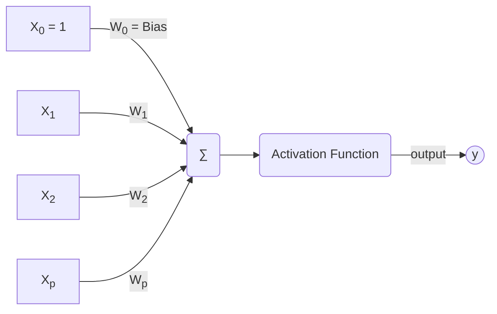

# Reti Neurali e Deep Learning - 9CFU

### Composizione esame
- Scritto
  - Domande aperte
  - domande su laboratorio in classe
  - Esercizi

## introduzione

Cosa sono le reti neurali?
Modelli computazionali che si ispirano al cervello umano per risolvere una serie di task
- Riconoscere digit all'interno  di un'immagine  
- Descrivere le immagini
- Memorizzare informazioni  per riuscire a ricostruire  immagini corrotte
- Scoprire regolarità all'interno di un dataset

Queste reti sono direttamente ispirate al comportamento del nostro cervello per risolvere determinati task, quindi le reti neurali prendono ispirazione dalla neuroscienze e dalla psicologia a al contempo viceversa infatti spesso le reti hanno potere esplicativo per capire come ragiona il nostro cervello per determinati task.

Sia all'interno del nostro cervello che nelle reti neurali l'elemento principale è il **Neurone**
Esso infatti è l'elemento base del nostro cervello e compie un'azione semplicissima:
Prendo l'informazione che mi arriva e se è maggiore di una certa soglia di attivazione la propago.

L'idea è che il singolo neurone è poco potente ma nel nostro cervello sono presenti circa 85 miliardi di neuroni uniti tra di loro da milioni di milioni sinapsi.

Nelle reti neurali abbiamo una struttura simile una serie di neuroni collegati tra loro da sinapsi artificiali simulate da pesi. Il **variare dei pesi** permette alla rete di apprendere. Infatti nelle reti neurali memoria e processamento si fondono.
 
I neuroni lavorano in parallelo. 

Il modello proposto da McCulloch–Pitts del 1943 è semplice



Abbiamo una serie di input $X_1 ... X_p$ associati a relativi pesi $W_1 ... W_p$ aggiunto a questo abbiamo un valore b detto **Bias** che ci permette di giocare con l'eccitabilità del neurone sostanzialmente quanto è più o meno sensibile a propagare il segnale. Per semplicità viene utilizzato come peso $W_0$ associato ad un input impostato sempre ad 1.  A questo punto l'input verso il neurone j viene così calcolato: 
$$J = \sum_{i=0}^{p} W_{ji} X_i $$

A questo punto l'input viene valutato dalla funzione i attivazione del neurone J per ottenere  l'output **y** ogni rete ha la sua struttura e la sua funzione di attivazione che la caratterizza rispetto alle altre.

## Percettrone
Il percepttrone è un modello di rete neurale artificiale, introdotto nel 1958 dallo psicologo statunitense Frank Rosenblatt. Il percettrone è un tipo di classificatore binario.

Questa architettura è molto semplice, è caratterizzata da in singolo livello di neuroni che ricevono $p$ input $X_1 ... X_p$. 

Questa architettura si puo applicare su problemi linearmente separabili, geometricamente, questa condizione descrive la situazione in cui esiste un iperpiano in grado di separare, nello spazio vettoriale degli input, quelli che richiedono un output positivo da quelli che richiedono un output negativo. Se il problema non è linearmente seprabile questo modello non converge e fallisce.

Per semplificare lo studio prendiamo in analisi un architettura composta da un singolo neurone e il bias viene inglobato nel vettore pesi W come $W_0$ associato all'input $X_0 = 1$.

La funzione di attivazione è molto semplice:
- Se la sommatoria del prodotto scalare del vettore di input X per quella dei relativi pesi W $\sum_{i=0}^{p} W_{ji} X_i > 0$ allora il neurone restituisce 1
- Altrimenti -1 quindi caso di $\sum_{i=0}^{p} W_{ji} X_i \leq 0$

Problemi semplici da modellare con questa configuarazione sono ad esempio il problema dell'OR oppure quello dell'AND. La rete per poter apprendere la configurazione di pesi corretta esegue il seguente pseudo codice:
```vbnet
n=0;
  Inizializza w casualmente; #Il vettore pesi inzialmente ha pesi casuali
  While(Abbiamo esempi del trainig set classificati male)
    Seleziono un esempio classificato male(x(n), d(n)) #x(n) è il nostro input mentre d(n) è il desiderato
    if(d(n)==1), W[n+1] = W(n) + ηx(n); #Se volevo ottenre 1 e ricevo -1 allora aggiungo al vettore pesi n+1 l'input classficato male moltiplicato per il learning rate
    if(d(n)==-1), W[n+1] = W(n) - ηx(n); #Se volevo ottenre -1 e ricevo 1 allora tolgo al vettore pesi n+1 l'input classficato male moltiplicato per il learning rate
    n=n+1;
  End While
```


Sappiamo che se il problema è linermente separabile grazie al **teorema di convergenza**

### Teorema di Convergenza
Questo teorema utilizza la rappresentazione geometrica deil vettore pesi e del vettore stimoli (input) geometricamente il prodotto tra due vettori in questo caso abbiamo  **w(n)** cioè w all'iterazione n e **x(n)** è uguale a $w(n) x(n) = ||w|| ||x|| cos(\theta)$ questo prodotto sarà: 
- maggiore di 0 se: l'angolo $-90 < \theta < 90$
- uguale a 0 se: l'angolo $\theta = 90$ oppure $\theta = 270$
- minore di 0 se: $90 < \theta < -90$
Geometricamente la soluzione proposta da un vettore pesi w è detto **Decision Boundary** cioè la retta perpendicolare al vettore dei psi che divide le due soluzioni. Tutti gli elementi alla destra del decision boundary hanno prodotto maggiore di 0 quindi il percettrone restituirà come output 1 mentre quelli sulla sinistra avranno prodotto minore o uguale a 0 e quindi il percettrone restituisce -1.

Ogni volta che applico l'algoritmo di apprendimento è come se cambiassi l'inclinazione del decision boundary.

Per dimostrare che i passaggi il teorema di convergenza dobbiamo capire che se il problema è linearmente separabile ad un certo punti troveremo un decision boundary che soddisfa in toto il nostro problema. Quindi dobbiamo dimostrare che i passaggi sono finiti.

Partiamo da qualche assunzione:
- il vettore pesi w viene inizializzato a 0
- il learning rate è posto a 1
- dobbiamo trasformare il problema in un problema equivalente normalizzato, vogliamo quindi che gli output del percettrone siano sempre 1 quindi nel caso in cui vogliamo il valore negativo dobbiamo moltiplicare per -1 gli input e l'output:

AND
| input | output |    | input   | output |
|-------|--------|----|---------|--------|
| 1,1,1  |     1   | -> |    1,  1,  1  |    1   |
| 1,1,0 |   -1   | -> | -1,-1, 0 |    1   |
| 1,0,1 |   -1   | -> | -1, 0,-1 |    1   |
| 1,0,0 |   -1   | -> |  -1, 0, 0 |    1   |

Questa trasformazione comporta che non abbiamo piu due possibilità in caso di mal classificazione, infatti l'unica opzione che abbiamo è che noi volessimo 1 come output e il vettore pesi proposto restituisca -1, quindi l'algoritmo di apprendimento è come se fosse semplificato. Questo ci permette di identificare il vettore pesi w(k+1) come la somma di tutti gli stimoli sbagliati da 1 a k quindi: $$w(k+1) = x(1) + ... + x(k)$$
Questo perchè w all'inizio è posto a 0

A questo punto vogliamo studiare come varia la norma al quadrato del vettore pesi ad ogni modifica, quindi ad ogni iterazione k. Il teorema di convergenza stabilisce 2 limiti:
1. Limite Inferiore: la norama del vettore peso al quadrato all'iteazione k+1 sarà sempre mggiore uguale di $k^2$ qualcosa, quindi crescerà almeno tanto velocemente quanto $k^2$. $$||w(k+1)||^2 \geq \frac{k^2 \alpha^2}{||w*||^2}$$ 
2. Limite Superiore:  la norama del vettore peso al quadrato all'iteazione k+1 deve essere minore uguale di k qualcos'altro. $$||w(k+1)||^2 \leq k \beta$$

Per rispettare entrambe i limiti sappiamo che c'è un momento in cui questi due limiti vengono invalidati. infatti $k^2$ cresce piu velocemente di k quindi avremo un momento in cui k deve smettere di crescere altrimenti i limiti vengono violati. Questo vuole dire che k crescerà in modo finito e terminerà prima che k contraddica uno dei due lower boud.

## ADALINE
Adaptive Linear Neuron comunemente conosciuta come Adaline è anch’essa un'architettura a singolo livello come il percettrone nasce nel 1960 dal professore Bernard Widrow e il dottorando Ted Hoff all’università di Stanford.

Si basa sempre sul neurone di McCulloch–Pitts.

## Self-Organizing Map
Le self-organizing map (**SOM**) sono un tipo di organizzazione di processi di informazione in rete analoghi alle reti neurali artificiali.

Le SOM sono addrestate usando l'apprendimento **non supervisionato** l'idea alla base è quella di dare in input alla rete un training set nel formato $x_1 ... x_n$ dove ogni $x$ è un vettore di pesi che rappresnta il singolo input. 

La rete dato un traning set modificherà il vettore pesi associato ad ogni neurone per fare in modo di riconoscere un determinato gruppo di input e mapparlo. Possiamo dire qundi che una SOM consente di produrre una rappresentazione dei campioni di training in uno spazio a bassa dimensione preservando le proprietà topologiche dello spazio degli ingressi.

La struttura delle SOM è differente dalle reti viste precedentemente. Non abbiamo piu il concetto di peso come sinapsi quindi collegamento tra neuroni qui abbiamo un'architettura piatta dove ogni neurone è collegato ad altri e questo collegaemnto indica semplicemente la vicinaza. Il vettore pesi è assocaito al neurone stesso e rappresenta quale input riconosce.

### Algoritmo di Apprendimento
L'obiettivo dell'apprendimento nelle self-organizing map è di specializzare parti differenti del reticolo SOM a rispondere similmente a particolari pattern d'ingresso. Questo è in parte motivato da come le informazioni sensoriali visive, uditive o di altro tipo sono gestite da parti separate della corteccia cerebrale nel cervello umano.

I pesi dei neuroni sono inizializzati a numeri casuali piccoli. 

L'addestramento utilizza l'apprendimento competitivo. Quando viene passato un campione di training in ingresso alla rete, viene calcolata la sua distanza euclidea da tutti i vettori dei pesi.  Quindi dato un input $x_i$ cerco qual è il neurone che lo "mappa" meglio. Il neurone col vettore dei pesi più simile all'ingresso è chiamato **Best Matching Unit** (BMU). 

I pesi del BMU e dei neuroni vicini a questo nel reticolo SOM vengono avvicinati al vettore d'ingresso, così facendo la BMU e i suoi vicini si *specializzano* nel riconoscere pattern simili a quello appena riconosciuto. L'intensità dell'avvicinamento decresce nel tempo e in funzione della distanza dei neuroni dal BMU. 

La formula utilizzata per l'aggiornamento dei pesi W di un neurone j è: $$w_j(n+1) = w_j(n)+ \eta(n) h_{j,i}(n)(x-w_j(n))$$

Abbiamo quindi il vettore pesi del neurone j per l'epoca n + 1 come la somma del suo vettore pesi attuale piu la differenza rispetto al suo vettore pesi attuale e l'input x ricevuto questo moltiplicato per due elemnti:
1. Il **Learning rate** $\eta$ decresce in modo monotono ad ogni nuova epoca per rendere meno impattante le modifiche sul peso dei neuroni.
2. la funzione $h_{j,i}$ detta **funzione di vicinato**, dipende dalla distanza nel reticolo fra il BMU (i) e il neurone j. Anch'essa decresce monotonicamente quindi con n vicina a 0 prenderemo molti neuroni vicini alla BMU piu si va avanti meno vicini subiranno l'aggioranamento. La BMU ha 1 come valore di $h_{j,i}$.

L'algoritmo di apprendimento ad ogni epoca quindi si compone di due macro fasi
1. La fase di **competizione** tra neuroni: calcolo la distanza euclidea per definire la BMU
2. La fase di **collaborazione**: Trovata la BMU aggiorno i pesi di essa e dei neuroni vicini nel reticolo 

### Passi dell'algoritmo
1. Assegna ai vettori dei pesi valori casuali
2. Prendi un vettore d'ingresso
3. Attraversa ogni nodo della mappa
    1. Usa la distanza euclidea per trovare somiglianze fra il vettore d'ingresso e il vettore dei pesi di ogni singolo nodo della mappa
    2. Individua il nodo a distanza minore (questo nodo verrà chiamato Best Matching Unit o BMU)
4. Aggiorna i nodi del vicinato di BMU "tirandoli" più vicino al vettore d'ingresso
$$w_j(n+1) = w_j(n)+ \eta(n) h_{j,i}(n)(x-w_j(n))$$

### Valutazione delle performance

